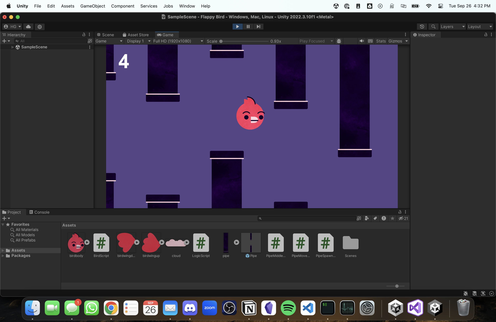

# Hector's Flappy Bird

## About the Game
This game is a clone of the popular Flappy Bird game, built from scratch using Unity. This version captures the same gameplay mechanics: flap the bird and avoid the pipes!

## How to Play
- Press the `Space Bar` to flap the bird.
- Avoid hitting the pipes.
- Try to get as far as you can!

## System Requirements
- Web browser (HTML5 compatible)

## How to Run the Game
Simply click [this link](your-game-link-here) to play the game in your web browser.

## Credits
- Game developed by Hector Gonzalez
- Built with Unity

## License
MIT License. See `LICENSE` for more information.